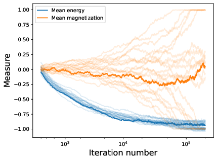
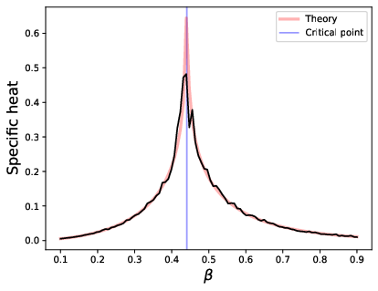
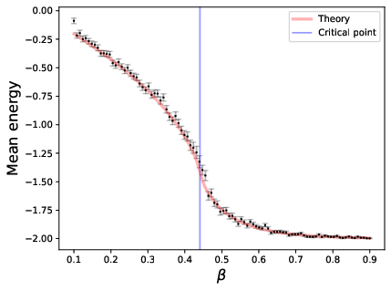
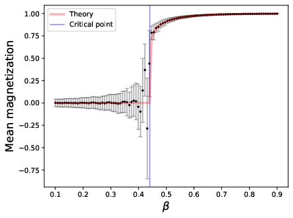

# ising-model

 

Simulation of the 2D square ising model using the python scientific tookit: `numpy`, `numba`, `scipy`, and a statistical trick from `astropy`.

# Running

Inside the `src` folder, run `pip install -r requirements.txt`

Then, `python ising_simulation.py` will run the script and generate the plots in the `src/out` directory. It will display a progress bar if the simulations takes long.

# Document

The `doc` folder contains a `typst` document with some explanations and conclusions about the simulation. 
All of the theoretical formulas are taken from [Onsager, Lars (1944-02-01). "Crystal Statistics. I. A Two-Dimensional Model with an Order-Disorder Transition". Physical Review. 65 (3–4): 117–149.](https://doi.org/10.1103%2FPhysRev.65.117)

A simple `typst compile ising_report.typ` will produce the PDF.

## Troubleshooting 

The `doc` folder has a symbolic link, so it may not work on a windows machine, in which case copy the `src/out` directory into a `doc/img` directory.
